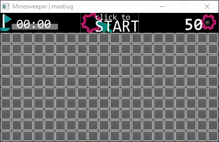

# Minesweeper2
 Minesweeper game in C++.

> **Przeczytaj [README w języku polskim](README.pl.md)!**

## Author
>   **Górka Mateusz**\
>   **maatiug@gmail.com**

## Table of contets
- [Minesweeper2](#Minesweeper2)
- [Author](#Author)
- [Game](#Game)
    - [Prepare](#Prepare)
    - [Running](#Running)
    - [Game rule](#Game\ rule)
- [Dev](#Dev)
    - [Documentation](#Documentation)
    - [Exception](#Exception)
    - [Specification](#Specification)
- [License](#License)

## Game
### Prepare:
Use a program [`make`](http://gnuwin32.sourceforge.net/packages/make.htm) to compile the code.

### Running:
By command: `./Minesweeper2.exe`.

Runing  arguments:
arg          | help
:-----------:|:--------
 -w \<num>   | width of board
 -h \<num>   | heigh of board
 -m \<num>   | number of mines

Exp.: `./Minesweeper2.exe -w 20 -h 15 -m 70`

### Game rule:
 - First click is always safe!
 - Game is finish when all no mine fields are uncovered.

## Dev
### Documentation
To generate documentation use program [doxygen](http://doxygen.nl).
You can use comand `make doxygen` in main project dir.
[Link to generated documentation](dox/html/index.phtml)

### Exception
Exception                                       | Why?
:-----------------------------------------------|:------
Can't find [file name]                          | app can't find a gui texture or font file in `/gui` dir.
Can't load file of textrue.                     | app can't find a texture of field in `/gui` dir.
Too much attempts to rand location of mines.    | rand a location of mines takes to long.
001                                             | Unexpected board::alloc()

### Specification
- Language: C++
- OS: Windows 10
- Compilator: **minGW**
- GUI: SFML Library

## License
See a file [LICENSE.md](LICENSE.md).

## To Do List
- [ ] Linux test
- [ ] Start and end game interface
- [ ] Board size modify by GUI
- [ ] One file compile (image, font zip in)