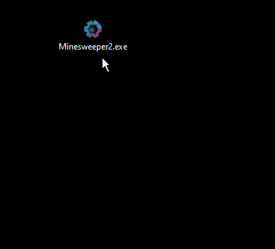
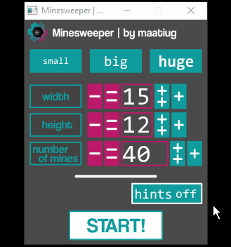

# Minesweeper2
 Minesweeper game in C++.

> **Przeczytaj [README w języku polskim](README.pl.md)!**

## Author
>   **Górka Mateusz**

## Table of contents
- [Minesweeper2](#minesweeper2)
  - [Author](#author)
  - [Table of contents](#table-of-contents)
  - [Game](#game)
    - [Prepare:](#prepare)
    - [Running:](#running)
    - [Game rule:](#game-rule)
  - [Dev](#dev)
    - [Documentation](#documentation)
    - [Exception](#exception)
    - [Specification](#specification)
  - [License](#license)
  - [To Do List](#to-do-list)

## Game
### Prepare:
Use a program [`make`](http://gnuwin32.sourceforge.net/packages/make.htm) to compile the code.

### Running:
By command: `./Minesweeper2.exe` or just click on the `.exe` file. ;)

Running  arguments to start game in console:
arg          | help
:-----------:|:--------
 -w \<num>   | width of board
 -h \<num>   | heigh of board
 -m \<num>   | number of mines
 -H          | turn on hints in the game

Exp.: `./Minesweeper2.exe -w 20 -h 15 -m 70`

### Game rule:
 - First click is always safe!
 - The game is finish when all no mine fields are uncovered.
 - The game include possibility to turn on the hints that show up after 5 seconds without action.

## Dev
### Documentation
To generate documentation use program [doxygen](http://doxygen.nl).
You can use command `make doxygen` in main project dir.
[Link to generated documentation](docs/index.html)

### Exception
Exception                                       | Why?
:-----------------------------------------------|:------
Too much attempts to rand location of mines.    | Rand a location of mines takes to long.
ALLOC 001                                       | Unexpected Board::alloc()
RESOURCES [...]                                 | That kind of errors is is related to memory access and resources in exe file.

### Specification
- Language: C++
- OS: Windows 10
- Complicator: **minGW**
- GUI: SFML Library

## License
See a file [LICENSE.md](LICENSE.md).

## To Do List
No new long term idea.
